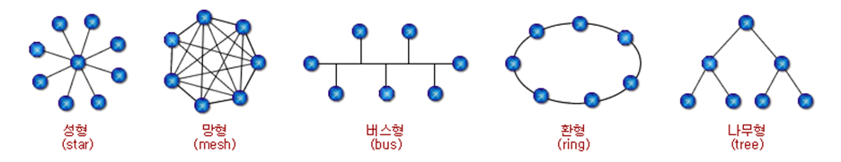

# SECTION 2.1 네트워크의 기초

- 네트워크란 노드(node)와 링크(link)가 서로 연결되어 있거나 연결되어 있으며 리소스를 공유하는 집합을 의미한다.
- 노드(node)란 서버, 라우터, 스위치 등 네트워크 장치를 의미하고 링크(link)는 유선 또는 무선을 의미한다.

### 인터넷(Internet)과 네트워크(Network) 차이

### **1. 네트워크 (Network)**

- **정의 및 개념**: 네트워크는 최소 두 개 이상의 장치가 서로 연결되어 데이터를 주고받을 수 있는 시스템입니다. 이 연결은 유선(케이블)이나 무선(Wi-Fi, Bluetooth) 방식으로 이루어질 수 있습니다.
- **구성 요소**: 네트워크는 주로 컴퓨터, 서버, 라우터, 스위치, 허브 등의 네트워크 장비와 연결됩니다.
- **범위**: 네트워크는 다음과 같이 범위에 따라 분류될 수 있습니다:
    - **LAN (Local Area Network)**: 가정, 사무실, 학교 등과 같이 좁은 지역에서 사용되는 네트워크입니다.
    - **MAN (Metropolitan Area Network)**: 도시나 대학교 캠퍼스와 같이 LAN보다 넓은 지역을 연결하는 네트워크입니다.
    - **WAN (Wide Area Network)**: 국가 또는 대륙 간의 넓은 지역을 연결하는 네트워크로, 인터넷도 WAN의 한 예입니다.
- **목적**: 주로 파일 공유, 리소스(프린터, 스토리지 등) 공유, 통신을 위해 구성됩니다.
- **보안**: 네트워크는 일반적으로 특정 사용자 그룹에 제한되어 있으며, 외부 접근은 제한적입니다.

### **2. 인터넷 (Internet)**

- **정의 및 개념**: 인터넷은 전 세계의 네트워크들이 서로 연결된 거대한 네트워크입니다. 인터넷은 TCP/IP 프로토콜을 사용하여 서로 다른 네트워크 간의 통신을 가능하게 합니다.
- **구성 요소**: 인터넷은 라우터, 스위치, 서버, 데이터 센터 등 수많은 네트워크 장비들이 상호 연결된 형태로 구성됩니다. 또한, 도메인 네임 시스템(DNS), IP 주소 등 다양한 기술적 요소가 작동합니다.
- **범위**: 전 세계적으로 확장된 네트워크입니다. 인터넷은 지리적 제약 없이 어디서나 접근할 수 있습니다.
- **목적**: 정보를 찾거나 공유하고, 커뮤니케이션(이메일, 메신저 등), 소셜 네트워크, 온라인 서비스(쇼핑, 뱅킹 등) 등 다양한 활동을 지원합니다.
- **보안**: 공개된 네트워크이기 때문에 방화벽, 암호화, VPN 등 다양한 보안 장치가 필요합니다.

### **핵심 차이점 정리**

1. **규모와 범위**:
    - 네트워크는 특정 지역이나 목적에 제한되어 있습니다.
    - 인터넷은 전 세계적으로 연결된 거대한 네트워크입니다.
2. **연결 방식**:
    - 네트워크는 유선/무선 기술을 사용하여 한정된 장치 간에 연결됩니다.
    - 인터넷은 TCP/IP 프로토콜을 사용하여 수많은 네트워크와 장치들이 상호 연결됩니다.
3. **보안 및 접근성**:
    - 네트워크는 보안이 비교적 쉬우며, 접근이 제한적입니다.
    - 인터넷은 보안 위협이 많아 더 많은 보안 장치와 기술이 필요합니다.
4. **주요 사용 사례**:
    - 네트워크는 주로 내부 통신 및 자원 공유에 사용됩니다.
    - 인터넷은 정보 검색, 전자 상거래, 소셜 네트워킹 등 다양한 목적에 사용됩니다.

이렇게 보면, 인터넷은 네트워크의 확장된 형태로 볼 수 있지만, 그 구성과 사용 목적, 보안 요구 사항에서 큰 차이가 있습니다.

# **2.1.1 처리량과 지연 시간**

## 처리량(throughput)

- 처리량(throughput)은 링크 내에서 성공적으로 전달된 데이터의 양을 말하며 보통 얼만큼의 트래픽을 처리했는지를 나타낸다. (’많은 트래픽 처리’ = ‘많은 처리량’)
- 단위로는 bps(bits per second)를 사용한다. bps는 초당 전송 또는 수신되는 비트 수이다.
- 처리량은 사용자들이 많이 접속할 때마다 커지는 트래픽, 네트워크 장치 간의 대역폭, 네트워크 중간에 발생하는 에러, 장치의 하드웨어 스펙에 영향을 받는다.
- 대역폭 : 주어진 시간 동안 네트워크 연결을 통해 흐를 수 있는 최대 비트 수

### **트래픽(Traffic)과** 처리량**(Throughput)** 차이

### **1. 트래픽 (Traffic)**

- **정의**: 트래픽은 네트워크를 통해 이동하는 전체 데이터의 양을 의미합니다. 즉, 특정 시간 동안 네트워크에 발생한 데이터 흐름을 나타냅니다.
- **측정 단위**: 보통 초당 비트 수(bps, bits per second)로 측정되며, Kbps, Mbps, Gbps 등의 단위로 표현됩니다.
- **특징**: 트래픽은 네트워크에 흐르는 모든 데이터(패킷)를 포함하며, 요청(업로드)과 응답(다운로드)을 모두 포함합니다. 트래픽이 많아지면 네트워크가 혼잡해지고, 성능 저하가 발생할 수 있습니다.
- **예시**: 웹사이트 방문자가 많아지면 트래픽이 증가합니다. 또한, 대용량 파일 다운로드, 스트리밍, 온라인 게임 등도 트래픽을 증가시킵니다.

### **2. 처리량 (Throughput)**

- **정의**: 처리량은 네트워크가 실제로 전달할 수 있는 데이터의 양을 의미합니다. 트래픽이 네트워크를 통해 얼마나 효과적으로 전달되는지를 나타내는 성능 지표입니다.
- **측정 단위**: 마찬가지로 bps, Kbps, Mbps, Gbps 등의 단위로 측정되지만, 실제로 전달된 데이터의 양을 나타내므로 더 현실적인 값입니다.
- **특징**: 처리량은 네트워크의 용량, 대역폭, 지연, 패킷 손실 등 여러 요인에 의해 영향을 받습니다. 트래픽이 많아도 네트워크의 처리량이 낮으면 데이터가 원활하게 전달되지 못합니다.
- **예시**: 1Gbps의 대역폭을 가진 네트워크에서 패킷 손실이나 지연이 발생하여 실제 전달된 데이터가 800Mbps라면, 처리량은 800Mbps입니다.

### **핵심 차이점 정리**

1. **의미**:
    - **트래픽**은 네트워크에 흐르는 전체 데이터 양을 의미합니다.
    - **처리량**은 네트워크가 실제로 전달할 수 있는 데이터 양을 의미합니다.
2. **영향 요인**:
    - **트래픽**은 사용자 행동(스트리밍, 다운로드 등)에 따라 변화합니다.
    - **처리량**은 네트워크 성능(대역폭, 혼잡, 패킷 손실 등)에 영향을 받습니다.
3. **관계**:
    - 높은 트래픽은 반드시 높은 처리량을 의미하지 않습니다. 트래픽이 많아도 네트워크 성능이 낮으면 처리량은 제한됩니다.
    - 처리량은 트래픽의 일부분이며, 네트워크 성능을 반영합니다.
4. **목적**:
    - **트래픽**은 네트워크 사용량을 모니터링하고, 용량 계획을 세우는 데 사용됩니다.
    - **처리량**은 네트워크 성능을 평가하고, 최적화의 필요성을 파악하는 데 사용됩니다.

결론적으로, 트래픽은 네트워크의 사용량을, 처리량은 네트워크의 실제 성능을 나타낸다고 할 수 있습니다.

## 지연 시간(latency)

- 지연 시간(latency)는 요청이 처리되는 시간으로, 어떤 메시지가 두 장치를 왕복하는데 걸린 시간이다.
- 지연 시간은 매체 타입(무선, 유선), 패킷 크기, 라우터의 패킷 처리 시간에 영향을 받는다.

### 매체 타입에 따라 지연 시간이 다른 이유

### **1. 매체 타입에 따른 지연시간 차이**

지연시간은 데이터가 한 지점에서 다른 지점으로 이동하는 데 걸리는 시간입니다. 매체 타입에 따라 지연시간이 달라지는 이유는 다음과 같습니다:

- **유선 네트워크 (Wired Network)**:
    - **매체**: 구리선(이더넷 케이블), 광섬유 등.
    - **전송 방식**: 물리적인 케이블을 통해 데이터를 전기적 신호(구리선)나 광신호(광섬유)로 전송합니다.
    - **지연시간**: 유선은 신호가 매체를 따라 곧바로 이동하기 때문에 상대적으로 지연시간이 짧습니다.
    - **속도**: 광섬유의 경우 빛의 속도로 데이터가 이동하여 지연이 매우 낮습니다.
    - **특징**: 신호 간섭이 적고, 전송 거리에 따른 신호 손실이 적어 안정적입니다.
- **무선 네트워크 (Wireless Network)**:
    - **매체**: 공기, 전파.
    - **전송 방식**: 데이터를 무선 신호로 전송합니다(Wi-Fi, LTE, 5G 등).
    - **지연시간**: 무선은 공기를 통해 데이터를 보내기 때문에 신호가 전파되면서 간섭, 장애물, 신호 감쇠 등의 요인으로 지연이 발생할 수 있습니다.
    - **속도**: 공기 중 신호 전파는 유선 매체에 비해 더 느리며, 전파 간섭이 발생하기 쉽습니다.
    - **특징**: 이동성은 좋지만, 신호 품질이 불안정할 수 있고, 거리나 장애물의 영향을 많이 받습니다.

### **2. 유선이 무선보다 빠른 이유**

유선이 무선보다 빠른 이유는 다음과 같은 물리적, 기술적 요인 때문입니다:

- **신호 간섭이 적음**: 유선은 구리선이나 광섬유를 통해 전송되기 때문에 외부 전파 간섭이 거의 없습니다. 반면 무선은 주변 환경(전자기파, 다른 무선 신호 등)으로부터 간섭을 받을 가능성이 큽니다.
- **전송 속도와 안정성**: 광섬유는 빛의 속도로 데이터를 전송하여 매우 높은 전송 속도를 자랑하며, 지연시간도 매우 낮습니다. 무선은 전파의 속도가 빛의 속도와 비슷하지만, 신호의 경로가 불안정하고 환경적 요인으로 지연이 발생할 수 있습니다.
- **대역폭**: 유선은 높은 대역폭을 제공할 수 있어 한 번에 더 많은 데이터를 전송할 수 있습니다. 예를 들어, 최신 이더넷 케이블은 최대 10Gbps 이상의 속도를 지원할 수 있습니다. 무선은 대역폭이 제한적이고, 여러 사용자가 동시에 접속하면 성능이 저하될 수 있습니다.
- **패킷 손실과 재전송**: 무선 네트워크는 신호 손실과 재전송이 발생하기 쉽습니다. 신호가 약하거나 장애물이 있으면 패킷이 손실되기 때문에 추가 지연이 발생합니다. 유선은 이런 문제가 상대적으로 적습니다.
- **거리에 따른 손실**: 유선은 일정한 거리를 넘어도 신호 증폭기를 사용하여 손실을 최소화할 수 있습니다. 무선은 거리가 멀어질수록 신호 강도가 급격히 감소합니다.

### **결론**

유선 네트워크는 물리적인 매체를 통해 데이터를 전송하기 때문에 간섭이 적고, 높은 대역폭과 안정성을 제공합니다. 반면, 무선 네트워크는 전파를 이용하기 때문에 간섭과 거리, 장애물에 취약하며, 대역폭이 제한적이라 지연시간이 더 발생할 수 있습니다. 이 때문에 유선이 무선보다 빠르고 안정적인 성능을 보이는 것입니다.

# **2.1.2 네트워크 토폴로지와 병목 현상**

## **네트워크 토폴로지**

- 네트워크 토폴로지(network topology)는 노드와 링크가 어떻게 배치되어 있는지에 대한 방식이자 연결 형태이다.
- 네트워크 토폴로지는 네트워크를 설계할 때 고려한다.
1. 트리 토폴로지 (tree Topology)
    
    계층형 토폴로지라고 하며 트리 형태로 배치한 네트워크 구성이다.
    
    노드의 추가, 삭제가 쉬우며 특정 노드에 트래픽이 집중될 때 하위 노드에 영향을 끼칠 수 있다.
    
2. 버스 토폴로지 (bus Topology)
    
    중앙 통신 회선 하나에 여러 개의 노드가 연결되어 공유하는 네트워크 구성을 말하며 근거리 통신망(LAN)에서 사용한다.
    
    설치 비용이 적고 신뢰성이 우수하며 중앙 통신 회선에 노드를 추가하거나 삭제하기 쉽다. 그러나 스푸핑이 가능하다는 문제점이 있다.
    
    ### **스니핑(Sniffing)과 스푸핑(Spoofing) 차이**
    
    ### **1. 스니핑 (Sniffing)**
    
    - **정의**: 스니핑은 네트워크에서 전송되는 데이터를 몰래 가로채고 감시하는 공격 방식입니다. 스니퍼(Sniffer)라는 도구를 사용하여 네트워크 트래픽을 실시간으로 캡처합니다.
    - **작동 방식**:
        - 스니퍼가 네트워크를 통과하는 패킷을 복사하여 데이터를 읽고 분석합니다.
        - **복사 전송 여부**: 스니핑은 데이터를 복사하여 감시할 뿐, 원본 데이터는 목적지로 정상적으로 전달되며 데이터 흐름에 영향을 주지 않습니다.
    - **목적**: 주로 비밀번호, 사용자 정보, 신용카드 정보 등 민감한 데이터를 감시하고 수집하는 데 사용됩니다.
    - **도구**: Wireshark, tcpdump 등 네트워크 패킷을 캡처하고 분석하는 소프트웨어가 대표적입니다.
    - **주요 특징**:
        - 데이터가 목적지로 전달되는 것을 방해하지 않고, 단순히 복사하여 정보를 수집합니다.
        - 네트워크를 통해 전송되는 모든 데이터가 대상이 됩니다.
    
    ### **2. 스푸핑 (Spoofing)**
    
    - **정의**: 스푸핑은 신뢰할 수 있는 사용자나 장치로 가장하여 데이터를 가로채거나 속이는 공격 방식입니다.
    - **작동 방식**:
        - 공격자가 자신을 신뢰할 수 있는 시스템의 IP 주소, MAC 주소, 혹은 DNS 서버 등으로 위장하여 통신합니다.
        - **복사 전송 여부**: 스푸핑은 가로챈 데이터를 복사하여 전송할 수 있을 뿐만 아니라, 데이터를 수정해서 목적지로 재전송할 수도 있습니다. 특히, 스푸핑과 MITM(Man-in-the-Middle) 공격이 결합되면, 공격자는 데이터를 가로챈 후 이를 **원래 목적지로 재전송**하거나 **변경된 데이터를 전송**할 수 있습니다. 즉, 공격자가 통신 흐름에 직접 개입하여 양쪽 모두가 정상적인 통신을 하고 있다고 믿게 만듭니다.
    - **목적**: 네트워크 침입, 데이터 수정, 권한 상승, 시스템 접근 등을 위해 사용됩니다.
    - **도구**: Ettercap, Arpspoof, dnsspoof 등 네트워크 조작 및 위장 공격에 사용됩니다.
    - **주요 특징**:
        - 공격자는 데이터를 가로챈 후, 이를 수정하거나 원래 목적지로 보낼 수 있습니다.
        - 특정 시스템이나 사용자를 목표로 삼아 신뢰성을 속입니다.
    
    ### **핵심 차이점 정리**
    
    1. **목적**:
        - **스니핑**: 데이터를 감시하고 수집하는 것이 목적입니다.
        - **스푸핑**: 신뢰할 수 있는 장치나 사용자로 위장하여 속이고, 데이터에 접근하거나 조작하는 것이 목적입니다.
    2. **작동 방식 및 복사 전송 여부**:
        - **스니핑**: 네트워크 트래픽을 복사하여 감시하지만, 원본 데이터를 원래 목적지로 전송하는 과정에는 영향을 미치지 않습니다.
        - **스푸핑**: 가로챈 데이터를 복사해서 전송할 수 있고, MITM 공격과 결합 시 데이터를 수정한 후 원래 목적지로 전송할 수도 있습니다.
    3. **공격 대상**:
        - **스니핑**: 네트워크를 통과하는 모든 데이터가 대상입니다.
        - **스푸핑**: 특정 시스템이나 사용자를 속여 접근을 시도합니다.
    4. **위협 수준**:
        - **스니핑**: 정보를 몰래 도청하여 데이터를 얻는 위험이 있습니다.
        - **스푸핑**: 시스템 접근, 권한 상승, 데이터 조작 등의 심각한 보안 위협이 있습니다.
    
    결론적으로, 스니핑은 데이터를 단순히 복사해 감시하는 데 초점을 맞추고 있으며, 스푸핑은 신뢰를 속여 데이터를 가로채거나 수정하여 재전송할 수 있는 보다 적극적인 공격 방식입니다. 두 기법 모두 네트워크 보안에 심각한 위협을 초래할 수 있습니다.
    
3. 스타 토폴로지 (성형, star Topology)
    
    중앙에 있는 노드에 모두 연결된 네트워크 구성이다.
    
    노드를 추가하거나 에러를 탐지하기 쉽고 패킷의 충돌 발생 가능성이 적다.
    
    어떠한 노드에 장애가 발생해도 쉽게 에러를 발견할 수 있으며 장애 노드가 중앙 노드가 아닐 경우 다른 노드에 영향을 끼치지 않는다. 하지만 중앙 노드에 장애가 발생하면 전체 네트워크를 사용할 수 없다. 
    
    중앙 노드에 고성능 장비가 필요하고 일반 노드가 모두 중앙 노드와 연결되므로 총 케이블 사용량이 증가하여 비용이 추가될 수 있어 설치 비용이 고가이다. (중앙 노드의 신뢰성과 안정성을 유지하기 위해 백업 장비나 관리 시스템을 추가 설치하는 경우도 있다.)
    
4. 링형 토폴로지(ring Topology)
    
    각각의 노드가 양 옆의 두 노드와 연결하여 전체적으로 고리처럼 하나의 연속된 길을 통해 통신을 하는 망 구성 방식이다.
    
    데이터는 노드에서 노드로 이동을 하게 되며, 각각의 노드는 고리 모양의 길을 통해 패킷을 처리한다.
    
    데이터가 한 방향을 순환하므로 노드 수가 증가되어도 네트워크 상의 손실이 거의 없고 충돌이 발생되는 가능성이 적고 노드의 고장 발견을 쉽게 찾을 수 있다. 
    
    하지만 네트워크 구성 변경이 어렵고 회선에 장애가 발생하면 전체 네트워크에 영향을 크게 끼치는 단점이 있다.
    
5. 메시 토폴로지 (mesh Topology)
    
    망형 토폴로지라고도 하며 그물망처럼 연결되어 있는 구조이다.
    
    한 단말 장치에 장애가 발생해도 여러 개의 경로가 존재하므로 네트워크를 계속 사용할 수 있고 트래픽도 분산 처리가 가능하다.
    
    하지만 노드의 추가가 어렵고 구축 비용과 운용 비용이 고가인 단점이 있다.
    
    ### 망형 토폴로지의 노드를 추가하거나 구축 및 운용하는 데 드는 비용이 높은 이유
    
    ### **1. 노드 간 연결 복잡성**
    
    - **완전 연결**: 망형 토폴로지에서는 각 노드가 네트워크의 모든 다른 노드와 직접 연결됩니다. 즉, n개의 노드가 있을 때, (n-1)개의 노드와 각각 연결되어야 하므로, 연결의 수는 (n*(n-1))/2 개가 됩니다. 이러한 완전 연결 방식은 대규모 네트워크에서는 노드 간의 물리적 연결을 복잡하게 만들고, 케이블링 및 장비 설치를 어렵게 합니다.
    - **연결 관리**: 모든 노드가 직접 연결되어 있기 때문에, 노드 추가 시 기존 네트워크의 모든 노드와 새로운 노드를 연결해야 하며, 이는 관리 및 설계 측면에서 복잡해집니다.
    
    ### **2. 구축 비용**
    
    - **케이블링 비용**: 망형 토폴로지에서는 모든 노드가 서로 직접 연결되므로 케이블의 양이 기하급수적으로 증가합니다. 많은 노드를 가진 네트워크의 경우, 케이블의 길이와 양이 매우 많아져 설치 비용이 크게 증가합니다.
    - **장비 비용**: 각 노드가 다른 모든 노드와 직접 연결되기 때문에, 네트워크 스위치, 라우터 등의 장비가 더 많이 필요합니다. 특히 대규모 망형 네트워크에서는 많은 장비를 설치하고 유지보수해야 하므로 초기 설치 비용이 매우 높아질 수 있습니다.
    
    ### **3. 운용 비용**
    
    - **유지보수와 관리**: 모든 노드가 서로 연결되어 있으므로, 네트워크의 유지보수와 관리가 복잡해집니다. 문제 발생 시, 특정 노드의 장애가 전체 네트워크에 영향을 줄 수 있기 때문에 문제를 진단하고 해결하는 데 시간이 많이 소요됩니다.
    - **확장성 문제**: 새로운 노드를 추가할 때 기존의 모든 노드와 연결해야 하므로, 네트워크 확장이 어렵고 추가 비용이 발생할 수 있습니다. 네트워크의 크기가 커질수록 이 문제는 더 두드러집니다.
    - **기술적 지원**: 망형 토폴로지를 구현하고 유지보수하는 데 필요한 기술적 지원이 추가로 필요할 수 있으며, 이는 운영 비용을 더욱 증가시킵니다.
    
    ### **결론**
    
    망형 토폴로지의 높은 구축 비용과 운용 비용은 주로 노드 간의 모든 직접 연결, 필요한 장비의 양, 복잡한 케이블링, 관리 및 유지보수의 복잡성에서 비롯됩니다. 노드 수가 많아질수록 연결의 수가 급격히 증가하여 비용이 상승하고, 관리와 유지보수가 어려워집니다. 이러한 이유로 망형 토폴로지는 높은 신뢰성과 안정성을 제공하지만, 비용 측면에서는 부담이 큰 구조입니다.
    

## 병목(bottleneck) 현상

전체 시스템의 성능이나 용량이 하나의 구성 요소로 인해 제한을 받는 현상이다.

# **2.1.3 네트워크 분류**

### 다양한 기준에 따른 네트워크 분류

### **1. 네트워크의 범위에 따른 분류**

- **PAN (Personal Area Network)**: 개인의 가까운 범위에서 사용하는 네트워크입니다. 일반적으로 10미터 이내의 거리에서 사용됩니다.
    - **예**: 블루투스, Wi-Fi Direct.
- **LAN (Local Area Network)**: 제한된 지역(예: 집, 사무실, 학교 등) 내에서 사용되는 네트워크입니다. 일반적으로 수십 미터에서 수백 미터까지의 범위를 커버합니다.
    - **예**: 집이나 사무실의 이더넷 네트워크, Wi-Fi.
- **WAN (Wide Area Network)**: 광범위한 지역(예: 도시, 국가, 전세계)에서 사용되는 네트워크입니다. 다양한 LAN을 연결하여 더 넓은 범위를 커버합니다.
    - **예**: 인터넷, 기업의 지사 간 연결 네트워크.
- **MAN (Metropolitan Area Network)**: 도시나 대도시 지역에서 사용하는 네트워크입니다. 일반적으로 LAN과 WAN의 중간 범위를 커버합니다.
    - **예**: 도시 내의 공공 Wi-Fi 네트워크, 대학교 캠퍼스 네트워크.
- **CAN (Campus Area Network)**: 캠퍼스나 연구소 같은 특정 지역 내의 네트워크입니다. 여러 개의 LAN이 연결되어 특정 지역 내에서 넓은 범위를 커버합니다.
    - **예**: 대학 캠퍼스 네트워크, 대규모 연구소 네트워크.

### **2. 네트워크의 구조에 따른 분류**

- **스타형 토폴로지 (Star Topology)**: 중앙 노드(허브, 스위치)와 여러 개의 말단 노드가 직접 연결된 구조입니다.
    - **장점**: 장애 진단 및 수정이 용이함.
    - **단점**: 중앙 노드의 장애 시 전체 네트워크가 영향을 받음.
- **버스형 토폴로지 (Bus Topology)**: 모든 노드가 하나의 중앙 케이블(버스)에 연결된 구조입니다.
    - **장점**: 설치가 간단하고 비용이 낮음.
    - **단점**: 케이블의 장애 시 전체 네트워크가 영향을 받음.
- **링형 토폴로지 (Ring Topology)**: 각 노드가 원형으로 연결되어 있으며, 데이터는 한 방향으로 순환합니다.
    - **장점**: 충돌이 적고 데이터 전송이 예측 가능함.
    - **단점**: 한 노드의 장애가 전체 네트워크에 영향을 미칠 수 있음.
- **망형 토폴로지 (Mesh Topology)**: 모든 노드가 서로 직접 연결되어 있는 구조입니다.
    - **장점**: 높은 신뢰성과 안정성.
    - **단점**: 구축 및 유지보수가 복잡하고 비용이 높음.

### **3. 네트워크의 기술적 특징에 따른 분류**

- **유선 네트워크 (Wired Network)**: 케이블을 통해 연결된 네트워크입니다.
    - **예**: 이더넷 네트워크, 광섬유 네트워크.
- **무선 네트워크 (Wireless Network)**: 무선 신호를 통해 연결된 네트워크입니다.
    - **예**: Wi-Fi, 블루투스, 셀룰러 네트워크.

### **4. 네트워크의 목적에 따른 분류**

- **사설 네트워크 (Private Network)**: 특정 조직이나 개인만 접근할 수 있는 네트워크입니다.
    - **예**: 기업 내부 네트워크, 가정용 네트워크.
- **공용 네트워크 (Public Network)**: 공공의 접근이 가능한 네트워크입니다.
    - **예**: 인터넷, 공공 Wi-Fi 네트워크.
- **가상 사설 네트워크 (VPN, Virtual Private Network)**: 공용 네트워크를 통해 사설 네트워크를 안전하게 확장하는 네트워크입니다.
    - **예**: 기업의 원격 근무를 위한 VPN.

### **5. 네트워크의 관리 방식에 따른 분류**

- **클라이언트-서버 네트워크 (Client-Server Network)**: 클라이언트가 서버에 서비스를 요청하고, 서버가 서비스를 제공하는 구조입니다.
    - **예**: 웹 서버와 웹 브라우저 간의 통신.
- **피어-투-피어 네트워크 (Peer-to-Peer Network)**: 모든 노드가 동등하게 서로에게 서비스를 제공하는 구조입니다.
    - **예**: 파일 공유 네트워크, 블록체인 네트워크.

### 네트워크의 범위에 따른 분류

### **1. BAN (Body Area Network)**

- **범위**: 신체에 가까운 범위 (약 1미터 이내)
- **특징**:
    - **주요 용도**: 개인의 건강 상태를 모니터링하고 데이터 수집을 위해 사용하는 네트워크입니다. 헬스케어 장비, 웨어러블 디바이스(예: 스마트워치, 심박수 모니터), 체온 센서 등이 포함됩니다.
    - **기술**: 블루투스, 저전력 블루투스 (BLE), Zigbee와 같은 근거리 무선 통신 기술을 사용합니다.
    - **비용**: 장비의 가격은 일반적으로 저렴하며, 데이터 전송은 주로 저전력 소모 방식으로 이루어집니다.
    - **장점**: 개인의 건강 데이터를 실시간으로 모니터링하고 수집할 수 있습니다. 건강 관리 및 피트니스 애플리케이션에서 매우 유용합니다.
    - **단점**: 장비의 배터리 수명이 제한될 수 있으며, 신체에 부착하거나 착용해야 하기 때문에 사용자의 편안함을 고려해야 합니다.

### **2. PAN (Personal Area Network)**

- **범위**: 약 10미터 이내 (가정용, 개인용 공간)
- **특징**:
    - **주요 용도**: 개인 기기 간의 데이터 전송 및 연결. 예를 들어, 스마트폰, 태블릿, 노트북, 무선 헤드폰 등이 포함됩니다.
    - **기술**: 블루투스, Wi-Fi Direct, 인프라스트럭처 모드와 같은 무선 통신 기술을 사용합니다.
    - **비용**: 일반적으로 설치 비용이 낮으며, 기본적으로 스마트폰이나 노트북에서 지원하는 기능이 많습니다.
    - **장점**: 사용이 간편하고, 개인 기기 간의 직접적인 데이터 전송이 가능하다.
    - **단점**: 커버리지가 매우 제한적이어서 넓은 공간에서는 사용이 불가능합니다.

### **3. LAN (Local Area Network)**

- **범위**: 몇 미터에서 몇 백 미터까지 (주로 건물 내)
- **특징**:
    - **주요 용도**: 사무실, 학교, 집 등에서 여러 장비를 연결하여 데이터와 자원을 공유하는 네트워크입니다.
    - **기술**: 이더넷 케이블, Wi-Fi와 같은 유선 및 무선 기술을 사용합니다.
    - **비용**: 구축 비용이 상대적으로 낮으며, 많은 가정과 기업에서 널리 사용됩니다.
    - **장점**: 높은 데이터 전송 속도와 안정성, 비교적 낮은 비용으로 설치할 수 있습니다.
    - **단점**: 물리적 범위가 제한적이며, 대규모 환경에서는 추가 장비가 필요할 수 있습니다.

### **4. CAN (Campus Area Network)**

- **범위**: 대규모 캠퍼스나 연구소 (수 백 미터에서 몇 킬로미터)
- **특징**:
    - **주요 용도**: 대학교 캠퍼스, 연구소, 기업 캠퍼스 내에서 사용됩니다. 여러 건물이나 구역을 연결하여 통합된 네트워크를 제공합니다.
    - **기술**: LAN 기술을 기반으로 하며, 캠퍼스 내의 다양한 위치를 연결하는 추가적인 인프라가 필요합니다.
    - **비용**: LAN보다 높은 비용이 들 수 있으며, 설계와 유지보수가 복잡할 수 있습니다.
    - **장점**: 캠퍼스 내의 다양한 위치에서 데이터와 자원을 효율적으로 공유할 수 있습니다.
    - **단점**: 설치와 유지보수 비용이 추가로 발생하며, 네트워크 관리가 복잡해질 수 있습니다.

### **5. MAN (Metropolitan Area Network)**

- **범위**: 도시 규모 (10km에서 100km)
- **특징**:
    - **주요 용도**: 도시 내의 다양한 장소나 기업을 연결하는 네트워크입니다. 대학교 캠퍼스, 공공 Wi-Fi 네트워크, 지역 인터넷 서비스 제공업체가 포함됩니다.
    - **기술**: 광섬유 케이블, 무선 기술 등 도시 내에서 효율적으로 데이터를 전송할 수 있는 기술을 사용합니다.
    - **비용**: LAN보다 설치 비용이 높지만, WAN보다 상대적으로 낮습니다.
    - **장점**: 도시 내의 다양한 위치에서 고속 데이터 전송이 가능하며, 중앙 집중식 관리가 용이합니다.
    - **단점**: 설치와 유지보수 비용이 증가할 수 있으며, 대규모 네트워크 관리가 필요합니다.

### **6. WAN (Wide Area Network)**

- **범위**: 광범위한 지역 (국가, 대륙, 전 세계)
- **특징**:
    - **주요 용도**: 지리적으로 분산된 지사, 사무소 및 데이터 센터를 연결하여 통합된 네트워크를 구축하는 것입니다. 인터넷이 대표적인 예입니다.
    - **기술**: 광섬유, 위성 통신, MPLS (Multiprotocol Label Switching) 등 고속 데이터 전송을 위한 다양한 기술을 사용합니다.
    - **비용**: 구축 및 운영 비용이 매우 높습니다. 또한, 국제적인 연결이 필요한 경우 추가 비용이 발생할 수 있습니다.
    - **장점**: 넓은 범위의 지역을 커버하며, 글로벌 네트워크를 통해 다양한 서비스와 리소스에 접근할 수 있습니다.
    - **단점**: 높은 구축 및 운영 비용, 지연 시간, 관리의 복잡성 등이 문제입니다.

# **2.1.4 네트워크 성능 분석 명령어**

- 네트워크 병목 현상의 주요 원인
    - 네트워크 대역폭
    - 네트워크 토폴로지
    - 서버 CPU, 메모리 사용량
    - 비효율적인 네트워크 구성
1. Ping(Packet INternet Groper)
    
    네트워크 상태를 확인하려는 대상 노드를 향해 일정 크기의 패킷을 전송하는 명령어이다.
    
    이를 통해 해당 노드의 패킷 수신 상태와 도달하기까지 시간 등을 알 수 있으며 해당 노드까지 네트워크가 잘 연결되어 있는지 확인할 수 있다.
    
    ping은 TCP/IP 프로토콜 중 ICMP 프로토콜을 통해 동작하며, 이 때문에 ICMP 프로토콜을 지원하지 않는 기기를 대상으로는 실행할 수 없거나 네트워크 정책상 ICMP나 traceroute를 차단하는 대상의 경우 ping 테스팅은 불가능하다.
    
2. netstat
    
    접속되어 있는 서비스들의 네트워크 상태를 표시하는 데 사용되며 네트워크 접속, 라우팅 테이블, 네트워크 프로토콜 등 리스트를 보여준다. 주로 서비스의 포트가 열려 있는지 확인할 때 사용한다.
    
    ### netstat 명령어의 상태 코드
    
    - 네트워크 연결의 현재 상태를 나타낸다.
    
    ### **1. `LISTENING`**
    
    - **의미**: 해당 포트에서 수신 대기 중인 상태입니다. 서버가 클라이언트의 연결 요청을 기다리고 있는 상태입니다.
    - **용도**: 서버 애플리케이션이 클라이언트의 연결을 받을 준비가 되어 있음을 나타냅니다.
    
    ### **2. `ESTABLISHED`**
    
    - **의미**: 연결이 성공적으로 설정되어 데이터 전송이 가능한 상태입니다.
    - **용도**: 클라이언트와 서버 간의 연결이 활성화되어 데이터 통신이 진행 중인 상태를 나타냅니다.
    
    ### **3. `CLOSE_WAIT`**
    
    - **의미**: 원격 호스트가 연결 종료를 요청했지만, 로컬 호스트가 아직 연결 종료를 완료하지 않은 상태입니다.
    - **용도**: 원격 호스트가 연결 종료 요청을 보냈고, 로컬 호스트가 이 요청을 수락했지만 종료 절차를 아직 완료하지 않은 상태입니다.
    
    ### **4. `TIME_WAIT`**
    
    - **의미**: 연결이 종료된 후, 일정 시간 동안 해당 포트를 사용하여 잠재적인 재전송 패킷을 처리할 수 있도록 대기하는 상태입니다.
    - **용도**: 연결 종료 후, 패킷이 네트워크에서 사라지도록 일정 시간 동안 대기합니다. 이 상태는 TCP의 연결 종료 절차에서 중요한 역할을 합니다.
    
    ### **5. `SYN_SENT`**
    
    - **의미**: 클라이언트가 연결 요청을 보내고 응답을 기다리는 상태입니다.
    - **용도**: 클라이언트가 서버에 연결 요청(SYN 패킷)을 보내고, 서버로부터의 응답을 기다리고 있는 상태입니다.
    
    ### **6. `SYN_RECEIVED`**
    
    - **의미**: 서버가 클라이언트의 연결 요청을 수신하고, 응답을 보내기 전에 대기 중인 상태입니다.
    - **용도**: 서버가 클라이언트의 연결 요청을 받았고, 클라이언트에게 응답을 보내기 위해 준비 중인 상태입니다.
    
    ### **7. `FIN_WAIT_1`**
    
    - **의미**: 로컬 호스트가 연결 종료 요청을 보냈고, 원격 호스트의 응답을 기다리는 상태입니다.
    - **용도**: 연결 종료 절차의 첫 번째 단계로, 로컬 호스트가 연결 종료 요청을 보낸 후 원격 호스트의 응답을 기다리고 있습니다.
    
    ### **8. `FIN_WAIT_2`**
    
    - **의미**: 원격 호스트의 연결 종료 요청을 수신하고, 로컬 호스트가 종료 절차를 완료하기 위해 기다리는 상태입니다.
    - **용도**: 로컬 호스트가 연결 종료 요청을 수신하고, 종료 절차를 계속 진행 중인 상태입니다.
    
    ### **9. `CLOSED`**
    
    - **의미**: 연결이 닫힌 상태입니다. 현재 해당 포트에서 활성화된 연결이 없음을 나타냅니다.
    - **용도**: 연결이 종료되어 더 이상 데이터 전송이 불가능한 상태입니다.
    
    ### **10. `UNKNOWN`**
    
    - **의미**: 상태를 확인할 수 없는 상태입니다.
    - **용도**: 네트워크 연결 상태를 확인할 수 없는 경우입니다.
3. nslookup
    
    DNS에 관련된 내용을 확인하기 위해 사용하는 명령어이다. 특정 도메인에 매핑된 IP를 확인하기 위해 사용한다.
    
4. tracert
    
    목적지 노드까지 네트워크 경로를 확인할 때 사용하는 명령어이다.
    
    목적지 노드까지 구간들 중 어느 구간에서 응답 시간이 느려지는지 등을 확인할 수 있다.
    
    윈도우에서는 tracert이고 리눅스에서는 traceroute 명령어로 구동된다.
    

# **2.1.5 네트워크 프로토콜 표준화**

- 네트워크 프로토콜은 다른 장치들끼리 데이터를 주고받기 위해 설정된 공통된 인터페이스이다.
- 프로토콜은 IEEE 또는 IETF라는 표준화 단체가 정한다.
- IEEE802.3은 유선 LAN 프로토콜로, 유선으로 LAN을 구축할 때 쓰이는 프로토콜이다. 이를 통해 만든 기업이 다른 장치라도 서로 데이터를 수신할 수 있다.