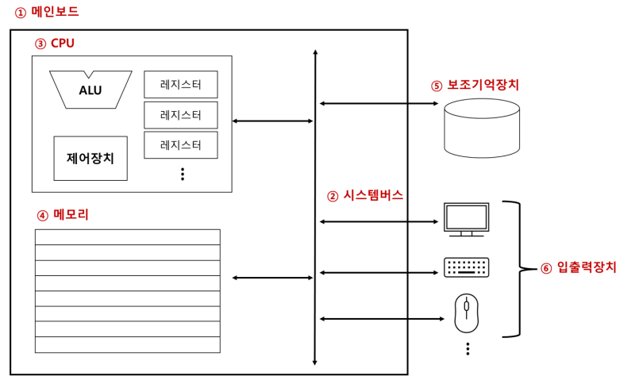
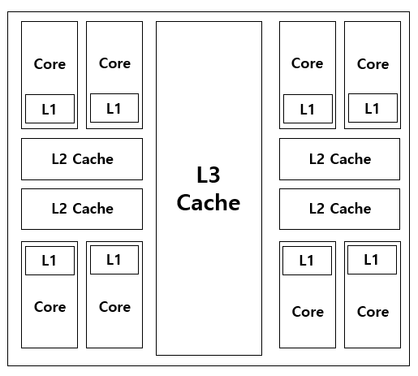

# Chapter 02. 컴퓨터 구조

# 1. 컴퓨터 구조의 큰 그림

- CPU
    - 산술논리연산장치(ALU, Arithmetic and Logic Unit) : 연산을 수행할 회로로 구성되어 있는 일종의 계산기
    - 제어장치(CU, Control Unit) : 명령어를 해석해 제어 신호라는 전기 신호로 내보내는 장치
    - 레지스터(register) : CPU 내부의 작은 임시 저장 장치로, 데이터와 명령어를 처리하는 과정의 중간값을 저장
- 메모리
    - 현재 실행 중인 프로그램을 구성하는 데이터와 명령어를 저장하는 부품
    - 휘발성 (전원이 공급되지 않을 때 저장하고 있는 정보가 지워지는 특성)
- 캐시 메모리
    - CPU가  조금이라도 더 빨리 메모리에 저장된 값에 접근하기 위해 사용하는 저장장치 (CPU와 메모리 사이)
- 보조기억장치
    - 보관한 프로그램을 저장
    - 비휘발성(전원이 꺼져도 저장된 정보가 사라지지 않는 특성)
- 입출력장치
    - 컴퓨터 외부에 연결되어 컴퓨터 내부와 정보를 교환하는 장치
- 메인보드와 버스
    - 메인보드에는 컴퓨터의 핵심 부품을 비롯한 여러 부품들이 연결된다.
    - 각 컴퓨터의 부품들은 버스를 통해 정보를 주고 받는다.

# 2. 컴퓨터가 이해하는 정보

- 부동소수점
    - 소수점을 나타내기 위해 대표적으로 사용하는 표현방식이다.
    - 소수점이 고정되어 있지 않은 소수 표현 방식으로, 필요에 따라 소수점의 위치가 이동할 수 있다.

# 3. CPU

- 대부분의 CPU가 공통적으로 포함하고 있는 대표적인 주요 레지스터
    1. 프로그램 카운터 : 메모리에서 다음으로 읽어 들일 명령어의 주소를 저장하는 레지스터
    2. 명령어 레지스터 : 메모리에서 방금 읽어 들인 명령어(해석할 명령어)를 저장하는 레지스터
    3. 범용 레지스터 : 다양하고 일반적인 상황에서 자유롭게 사용할 수 있는 레지스터
    4. 플래스 레지스터 : 연산의 결과 혹은 CPU 상태에 대한 부가 정보인 플래그 값을 저장하는 레지스터
    5. 스택 포인터 : 메모리 내 스택 영역의 최상단 스택 데이터 위치를 가리키는 레지스터
- 인터럽트
    - CPU의 작업을 방해하는 신호
    - 인터럽트의 분류
        1. 동기 인터럽트(예외) : 프로그래밍 오류와 같은 예외적인 상황에 발생하는 인터럽트
        2. 비동기 인터럽트(하드웨어 인터럽트) : 입출력장치에 의해 발생하는 인터럽트
- CPU 클럭 속도
    - 클럭은 컴퓨터의 부품을 일사불란하게 움직일 수 있게 하는 시간의 단위
    - 클럭 속도는 헤르츠(Hz) 단위로 측정되며, 클력이 1초에 몇 번 반복되는지를 나타낸다.
- 멀티코어와 멀티스레드
    - 코어는 CPU 내에서 명령어를 읽어 들이고, 해석하고, 실행하는 부품이다.
    - 여러 개의 코어를 포함하고 있는 CPU를 멀티코어 CPU, 혹은 멀티코어 프로세서하고 한다.
    - 스레드의 사전적 의미는 ‘실행 흐름의 단위’이다.
    - 하드웨어 스레드는 하나의 코어가 동시에 처리하는 명령어의 단위이다.
    - 소프트웨어 스레드는 하나의 프로그램에서 독립적으로 실행되는 단위이다.
- 동시성과 병렬성 차이
    - 동시성과 병렬성은 모두 ‘여러 작업이 동시에 처리되는 양상’을 표현하는 단어이다.
    - 병렬성은 작업을 물리적으로 동시에 처리하는 성질이다.
    - 동시성은 동시에 작업을 처리하는 것처럼 보이는 성질이다.
- 파이프라이닝을 통한 명령어 병렬 처리
    - CPU의 성능을 향상시키기 위해 명령어를 여러 단계로 나누어 동시에 처리하는 방식
    - 파이프라이닝의 작동 방식
        - 파이프라이닝은 명령어 실행을 여러 단계로 나누고, 각 단계를 동시에 처리하도록 설계된다. 각 명령어는 여러 단계로 나뉘고, 각 단계는 한 번에 한 부분만 실행되며 다른 명령어와 병렬로 처리된다.
    - 파이프라이닝의 장점
        - **성능 향상**: 명령어를 병렬로 처리하기 때문에 명령어당 처리 시간이 줄어듭니다.
        - **효율적인 자원 사용**: CPU의 다양한 유닛을 동시에 활용할 수 있습니다.
    - 파이프라이닝의 한계
        - **데이터 종속성(Data Hazard)**: 이전 명령어의 결과가 아직 나오지 않았는데, 그 결과를 필요로 하는 다음 명령어가 실행될 때 발생합니다.
        - **제어 종속성(Control Hazard)**: 분기 명령어(조건문) 실행 시 발생할 수 있으며, 다음에 실행될 명령어가 확실하지 않으면 파이프라인이 중단될 수 있습니다.
        - **구조적 종속성(Structural Hazard)**: 하드웨어 자원이 겹치는 경우 자원 충돌이 발생할 수 있습니다.

# 4. 메모리

- RAM의 종류
    - DRAM : 시간이 지나면 저장된 데이터가 점차 사라지는 RAM
    - SRAM :  시간이 지나도 저장된 데이터가 사라지지 않는 RAM
    - SDRAM :  클럭 신호와 동기화된, 보다 발전된 형태의 DRAM
    - DDR SDRAM : 대역폭을 넓혀 속도를 빠렉 만든 SDRAM
- 빅 엔디안과 리틀 엔디안
    - 빅 엔디안 : 낮은 번지의 주소에 상위 바이트부터 저장하는 방식
    - 리틀 엔디안 : 낮은 번지의 주소에 하위 바이트부터 저장하는 방식
- 캐시 메모리
    - CPU의 연산 속도와 메모리 접근 속도의 차이를 줄이기 위해 탄생한 저장장치로, CPU와 메모리 사이에 위치한 SRAM 기반의 저장장치이다.
    - 코어와 가장 가까운 캐시 메모리를 L1 캐시, 그 다음으로 가까운 캐시 메모리를 L2 캐시, 그 다음으로 가까운 캐시 메모리를 L3 캐시라고 부른다. 일반적으로 L1 캐시와 L2 캐시는 코어 내부에 , L3 캐시는 코어 외부에 위치애 있다.
        
        
        
    - 캐시 히트는 캐시 메모리가 예측하여 저장한 데이터가 CPU에 의해 실제로 사용되는 경우이다.
    - 캐시 미스는 자주 사용될 것으로 예측하여 캐시 메모리에 저장했지만 틀린 예측으로 인해 CPU 메모리로부터 필요한 데이터를 직접 가져와야 하는 경우이다.
    - 참조 지역성의 원리
        - 시간 지역성 : CPU는 최근에 접근했던 메모리 공간에 다시 접근하려는 경향이 있다.
        - 공간 지역성 : CPU는 접근한 메모리 공간의 근처에 접근하려는 경향이 있다.

# 보조기억장치와 입출력장치

- RAID
    - 데이터의 안전성 혹은 성능을 확보하기 위해 여러 개의 독립적인 보조기억장치를 마치 하나의 보조기억장치처럼 사용하는 기술이다.
- RAID를 구성하는 방법
    - RAID0 : 단순하게 나누어 저장하는 구성 방식
    - RAID1 : 완전한 복사본을 만들어 저장하는 구성 방식으로, 미러링이라고도 한다.
    - RAID4 : 패리티 정보를 저장하는 디스크를 따로 두는 구성 방식
    - RAID5 : 패리티를 분산하여 저장하는 구성 방식
    - RAID6 : 서로 다른 2개의 패리티를 두는 구성 방식 (패리티 분산 저장)
- 장치 컨트롤러와 장치 드라이버
    - 장치 컨트롤러 : CPU와 입출력장치 사이의 통신을 중개하는 중개자 역할의 하드웨어
    - 장치 드라이버 : 장치 컨트롤러의 동작을 알고, 장치 컨트롤러가 컴퓨터 내부와 정보를 주고받을 수 있도록 하는 프로그램
- 입출력 작업 수행 방법
    1. 프로그램 입출력 : 프로그램 속 명령어로 입출력 작업을 수행하는 방법
    2. 인터럽트 기반 입출력 : 다중 인터럽트 : 인터럽트가 여러 입출력장치로부터 동시다발적으로 발생하는 경우 우선순위가 더 높은 인터럽트가 우선적으로 처리된다.
    3. DMA 입출력 : DMA 컨트롤러가 입출력 작업을 처리하여 CPU는 DMA 컨트롤러에게 입출력 작업 명령을 내리고, 인터럽트만 받으면 된다.